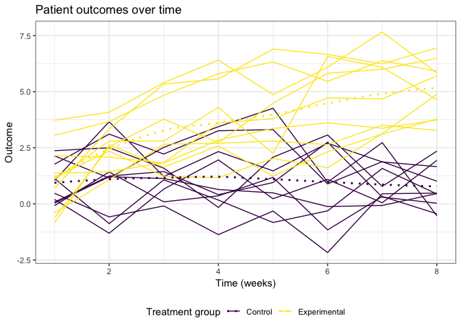

p8105\_hw5\_amv2187
================
Alyssa Vanderbeek
11/7/2018

### Problem 1

``` r
patient_data = tibble(
  patient = list.files('./data/problem1'), # get file names
  data = map(paste0('./data/problem1/', patient), read.csv) # read each file as list entry in column
)

head(patient_data)
```

    ## # A tibble: 6 x 2
    ##   patient    data                
    ##   <chr>      <list>              
    ## 1 con_01.csv <data.frame [1 × 8]>
    ## 2 con_02.csv <data.frame [1 × 8]>
    ## 3 con_03.csv <data.frame [1 × 8]>
    ## 4 con_04.csv <data.frame [1 × 8]>
    ## 5 con_05.csv <data.frame [1 × 8]>
    ## 6 con_06.csv <data.frame [1 × 8]>

``` r
patient_data_tidy = patient_data %>%
  unnest(.id = 'patient') %>% # unnest the list column of patient outcomes
  gather(key = week, value = outcome, contains("week")) %>% # wide to long
  mutate(arm = str_sub(patient, 1, 3), # get arm assignment from file name
         patient = as.numeric(str_sub(patient, 5, 6)), # get patient id from file name
         week = as.numeric(str_sub(week, 6))) %>% # make week indicator single numeric value
  select(arm, patient, week, outcome) # select and reorder desired columns

str(patient_data_tidy)
```

    ## Classes 'tbl_df', 'tbl' and 'data.frame':    160 obs. of  4 variables:
    ##  $ arm    : chr  "con" "con" "con" "con" ...
    ##  $ patient: num  1 2 3 4 5 6 7 8 9 10 ...
    ##  $ week   : num  1 1 1 1 1 1 1 1 1 1 ...
    ##  $ outcome: num  0.2 1.13 1.77 1.04 0.47 2.37 0.03 -0.08 0.08 2.14 ...

``` r
patient_data_tidy %>%
  mutate(id = paste0(arm, patient)) %>% # create one grouping variable of arm assignment and patient id within that arm
  ggplot(aes(x = week, y = outcome, group = id, color = arm)) +
  geom_line() + # spaghetti plot grouped by patient
  geom_smooth(method = 'loess', aes(group = arm), se = F, lty = 3) + # fit smoothed curves for each trt group
  labs(
    title = 'Patient outcomes over time',
    x = 'Time (weeks)',
    y = 'Outcome'
  ) + 
  viridis::scale_color_viridis(
    name = 'Treatment group',
    discrete = T
  ) +
  theme(legend.position = 'bottom') # aesthetics
```



### Problem 2

``` r
homicide_data = read_csv('./data/problem2/homicide-data.csv') # read in data
```

    ## Parsed with column specification:
    ## cols(
    ##   uid = col_character(),
    ##   reported_date = col_integer(),
    ##   victim_last = col_character(),
    ##   victim_first = col_character(),
    ##   victim_race = col_character(),
    ##   victim_age = col_character(),
    ##   victim_sex = col_character(),
    ##   city = col_character(),
    ##   state = col_character(),
    ##   lat = col_double(),
    ##   lon = col_double(),
    ##   disposition = col_character()
    ## )

``` r
homicide_data_tidy = homicide_data %>%
  mutate(city_state = paste(city, state, sep = ', ')) %>% # create city_state variable
  mutate(unsolved = str_detect(disposition, 
                               paste(c('Closed without arrest', 'Open/No arrest'), 
                                     collapse = '|'))) # logical for unsolved yes/no
homicide_data_tidy %>%
  group_by(city_state) %>% 
  summarise(n_homicides = n(),
            n_unsolved = sum(unsolved)) %>%
  knitr::kable()
```

| city\_state        |  n\_homicides|  n\_unsolved|
|:-------------------|-------------:|------------:|
| Albuquerque, NM    |           378|          146|
| Atlanta, GA        |           973|          373|
| Baltimore, MD      |          2827|         1825|
| Baton Rouge, LA    |           424|          196|
| Birmingham, AL     |           800|          347|
| Boston, MA         |           614|          310|
| Buffalo, NY        |           521|          319|
| Charlotte, NC      |           687|          206|
| Chicago, IL        |          5535|         4073|
| Cincinnati, OH     |           694|          309|
| Columbus, OH       |          1084|          575|
| Dallas, TX         |          1567|          754|
| Denver, CO         |           312|          169|
| Detroit, MI        |          2519|         1482|
| Durham, NC         |           276|          101|
| Fort Worth, TX     |           549|          255|
| Fresno, CA         |           487|          169|
| Houston, TX        |          2942|         1493|
| Indianapolis, IN   |          1322|          594|
| Jacksonville, FL   |          1168|          597|
| Kansas City, MO    |          1190|          486|
| Las Vegas, NV      |          1381|          572|
| Long Beach, CA     |           378|          156|
| Los Angeles, CA    |          2257|         1106|
| Louisville, KY     |           576|          261|
| Memphis, TN        |          1514|          483|
| Miami, FL          |           744|          450|
| Milwaukee, wI      |          1115|          403|
| Minneapolis, MN    |           366|          187|
| Nashville, TN      |           767|          278|
| New Orleans, LA    |          1434|          930|
| New York, NY       |           627|          243|
| Oakland, CA        |           947|          508|
| Oklahoma City, OK  |           672|          326|
| Omaha, NE          |           409|          169|
| Philadelphia, PA   |          3037|         1360|
| Phoenix, AZ        |           914|          504|
| Pittsburgh, PA     |           631|          337|
| Richmond, VA       |           429|          113|
| Sacramento, CA     |           376|          139|
| San Antonio, TX    |           833|          357|
| San Bernardino, CA |           275|          170|
| San Diego, CA      |           461|          175|
| San Francisco, CA  |           663|          336|
| Savannah, GA       |           246|          115|
| St. Louis, MO      |          1677|          905|
| Stockton, CA       |           444|          266|
| Tampa, FL          |           208|           95|
| Tulsa, AL          |             1|            0|
| Tulsa, OK          |           583|          193|
| Washington, DC     |          1345|          589|

``` r
homicide_data_tidy %>%
  filter(city_state == 'Baltimore, MD') %>% 
  summarise(n_unsolved = sum(unsolved),
            n_homicides = n()) %>% 
  rowwise() %>%
  mutate(tst = list(broom::tidy(prop.test(n_unsolved, n_homicides)))) %>%
  unnest(tst)
```

    ## # A tibble: 1 x 10
    ##   n_unsolved n_homicides estimate statistic  p.value parameter conf.low
    ##        <int>       <int>    <dbl>     <dbl>    <dbl>     <int>    <dbl>
    ## 1       1825        2827    0.646      239. 6.46e-54         1    0.628
    ## # ... with 3 more variables: conf.high <dbl>, method <chr>,
    ## #   alternative <chr>

``` r
homicide_data_tidy %>%
  group_by(city_state) %>% 
  summarise(n_homicides = n(),
            n_unsolved = sum(unsolved)) %>%
  rowwise() %>%
  mutate(tst = list(broom::tidy(prop.test(n_unsolved, n_homicides)))) %>%
  unnest(tst)
```

    ## Warning in prop.test(n_unsolved, n_homicides): Chi-squared approximation
    ## may be incorrect

    ## # A tibble: 51 x 11
    ##    city_state n_homicides n_unsolved estimate statistic   p.value parameter
    ##    <chr>            <int>      <int>    <dbl>     <dbl>     <dbl>     <int>
    ##  1 Albuquerq…         378        146    0.386   19.1    1.23e-  5         1
    ##  2 Atlanta, …         973        373    0.383   52.5    4.32e- 13         1
    ##  3 Baltimore…        2827       1825    0.646  239.     6.46e- 54         1
    ##  4 Baton Rou…         424        196    0.462    2.27   1.32e-  1         1
    ##  5 Birmingha…         800        347    0.434   13.8    2.05e-  4         1
    ##  6 Boston, MA         614        310    0.505    0.0407 8.40e-  1         1
    ##  7 Buffalo, …         521        319    0.612   25.8    3.73e-  7         1
    ##  8 Charlotte…         687        206    0.300  109.     1.41e- 25         1
    ##  9 Chicago, …        5535       4073    0.736 1231.     1.28e-269         1
    ## 10 Cincinnat…         694        309    0.445    8.11   4.41e-  3         1
    ## # ... with 41 more rows, and 4 more variables: conf.low <dbl>,
    ## #   conf.high <dbl>, method <chr>, alternative <chr>
