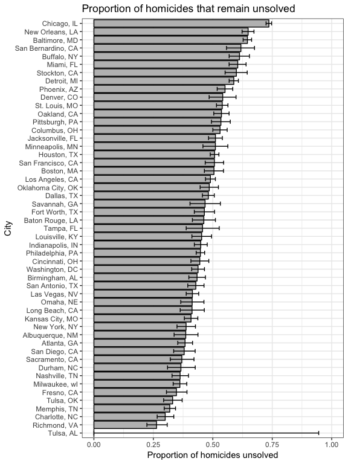

p8105\_hw5\_amv2187
================
Alyssa Vanderbeek
11/7/2018

### Problem 1

``` r
patient_data = tibble(
  patient = list.files('./data/problem1'), # get file names
  data = map(paste0('./data/problem1/', patient), read.csv) # read each file as list entry in column
)

head(patient_data)
```

    ## # A tibble: 6 x 2
    ##   patient    data                
    ##   <chr>      <list>              
    ## 1 con_01.csv <data.frame [1 × 8]>
    ## 2 con_02.csv <data.frame [1 × 8]>
    ## 3 con_03.csv <data.frame [1 × 8]>
    ## 4 con_04.csv <data.frame [1 × 8]>
    ## 5 con_05.csv <data.frame [1 × 8]>
    ## 6 con_06.csv <data.frame [1 × 8]>

``` r
patient_data_tidy = patient_data %>%
  unnest(.id = 'patient') %>% # unnest the list column of patient outcomes
  gather(key = week, value = outcome, contains("week")) %>% # wide to long
  mutate(arm = str_sub(patient, 1, 3), # get arm assignment from file name
         patient = as.numeric(str_sub(patient, 5, 6)), # get patient id from file name
         week = as.numeric(str_sub(week, 6))) %>% # make week indicator single numeric value
  select(arm, patient, week, outcome) # select and reorder desired columns

str(patient_data_tidy)
```

    ## Classes 'tbl_df', 'tbl' and 'data.frame':    160 obs. of  4 variables:
    ##  $ arm    : chr  "con" "con" "con" "con" ...
    ##  $ patient: num  1 2 3 4 5 6 7 8 9 10 ...
    ##  $ week   : num  1 1 1 1 1 1 1 1 1 1 ...
    ##  $ outcome: num  0.2 1.13 1.77 1.04 0.47 2.37 0.03 -0.08 0.08 2.14 ...

``` r
patient_data_tidy %>%
  mutate(id = paste0(arm, patient)) %>% # create one grouping variable of arm assignment and patient id within that arm
  ggplot(aes(x = week, y = outcome, group = id, color = arm)) +
  geom_line() + # lines for each patient
  geom_smooth(method = 'loess', aes(group = arm), se = F, lty = 3) + # fit smoothed curves for each trt group
  labs(
    title = 'Patient outcomes over time',
    x = 'Time (weeks)',
    y = 'Outcome'
  ) + 
  viridis::scale_color_viridis(
    name = 'Treatment group',
    labels = c('Control', 'Experimental'),
    discrete = T
  ) +
  theme(legend.position = 'bottom') # aesthetics
```


The above figure displays the outcomes for each patient (solid lines), as well as fitted loess curves for each treatment groups (dotted lines). At the start of the study, there is overlap in outcomes betweens treatment groups. However, the differences between groups widen as time goes on.

### Problem 2

``` r
homicide_data = read_csv('./data/problem2/homicide-data.csv') # read in data
```

    ## Parsed with column specification:
    ## cols(
    ##   uid = col_character(),
    ##   reported_date = col_integer(),
    ##   victim_last = col_character(),
    ##   victim_first = col_character(),
    ##   victim_race = col_character(),
    ##   victim_age = col_character(),
    ##   victim_sex = col_character(),
    ##   city = col_character(),
    ##   state = col_character(),
    ##   lat = col_double(),
    ##   lon = col_double(),
    ##   disposition = col_character()
    ## )

``` r
homicide_data_tidy = homicide_data %>%
  mutate(city_state = paste(city, state, sep = ', ')) %>% # create city_state variable
  mutate(unsolved = str_detect(disposition, 
                               paste(c('Closed without arrest', 'Open/No arrest'), 
                                     collapse = '|'))) # logical for unsolved yes/no
```

The data provided by the Washington Post contains information on homicides in 50 large US cities reported between 2007 and 2015. Data regarding the city, victim demographics (name, age, sex), date of the report, coordinates of the crime, and the status of the case is provided. The dataset is clean, although there is a single entry for Tulsa, AL, which appears to be a mistake.

``` r
# number of total and unsolved homicides in each city
homicide_data_tidy %>%
  group_by(city_state) %>% 
  summarise(n_homicides = n(),
            n_unsolved = sum(unsolved)) %>%
  knitr::kable(col.names = c('City', 'Total homicides', 'Unsolved homicides'))
```

| City               |  Total homicides|  Unsolved homicides|
|:-------------------|----------------:|-------------------:|
| Albuquerque, NM    |              378|                 146|
| Atlanta, GA        |              973|                 373|
| Baltimore, MD      |             2827|                1825|
| Baton Rouge, LA    |              424|                 196|
| Birmingham, AL     |              800|                 347|
| Boston, MA         |              614|                 310|
| Buffalo, NY        |              521|                 319|
| Charlotte, NC      |              687|                 206|
| Chicago, IL        |             5535|                4073|
| Cincinnati, OH     |              694|                 309|
| Columbus, OH       |             1084|                 575|
| Dallas, TX         |             1567|                 754|
| Denver, CO         |              312|                 169|
| Detroit, MI        |             2519|                1482|
| Durham, NC         |              276|                 101|
| Fort Worth, TX     |              549|                 255|
| Fresno, CA         |              487|                 169|
| Houston, TX        |             2942|                1493|
| Indianapolis, IN   |             1322|                 594|
| Jacksonville, FL   |             1168|                 597|
| Kansas City, MO    |             1190|                 486|
| Las Vegas, NV      |             1381|                 572|
| Long Beach, CA     |              378|                 156|
| Los Angeles, CA    |             2257|                1106|
| Louisville, KY     |              576|                 261|
| Memphis, TN        |             1514|                 483|
| Miami, FL          |              744|                 450|
| Milwaukee, wI      |             1115|                 403|
| Minneapolis, MN    |              366|                 187|
| Nashville, TN      |              767|                 278|
| New Orleans, LA    |             1434|                 930|
| New York, NY       |              627|                 243|
| Oakland, CA        |              947|                 508|
| Oklahoma City, OK  |              672|                 326|
| Omaha, NE          |              409|                 169|
| Philadelphia, PA   |             3037|                1360|
| Phoenix, AZ        |              914|                 504|
| Pittsburgh, PA     |              631|                 337|
| Richmond, VA       |              429|                 113|
| Sacramento, CA     |              376|                 139|
| San Antonio, TX    |              833|                 357|
| San Bernardino, CA |              275|                 170|
| San Diego, CA      |              461|                 175|
| San Francisco, CA  |              663|                 336|
| Savannah, GA       |              246|                 115|
| St. Louis, MO      |             1677|                 905|
| Stockton, CA       |              444|                 266|
| Tampa, FL          |              208|                  95|
| Tulsa, AL          |                1|                   0|
| Tulsa, OK          |              583|                 193|
| Washington, DC     |             1345|                 589|

``` r
# prop.test output for Baltimore, MD
homicide_data_tidy %>%
  filter(city_state == 'Baltimore, MD') %>% # select rows for Baltimore, MD only
  summarise(n_unsolved = sum(unsolved), # get total number of homicides
            n_homicides = n()) %>% # total number of unsolved homicides
  mutate(tst = list(broom::tidy(prop.test(n_unsolved, n_homicides)))) %>% # perform prop.test and save output as new column
  unnest(tst) %>% # unnest prop.test output
  select(estimate, conf.low, conf.high) %>% # select variables of interest
  knitr::kable(caption = 'Proportion of unsolved homicides in Baltimore, MD',
               col.names = c('Proportion', '95% CI lower bound', '95% CI upper bound'))
```

|  Proportion|  95% CI lower bound|  95% CI upper bound|
|-----------:|-------------------:|-------------------:|
|   0.6455607|           0.6275625|           0.6631599|

``` r
# prop.test output for all cities
city_prop = homicide_data_tidy %>%
  group_by(city_state) %>% 
  summarise(n_homicides = n(),
            n_unsolved = sum(unsolved)) %>%
  mutate(tst = map2(.x = n_unsolved, .y = n_homicides, ~ broom::tidy(prop.test(.x, n = .y)))) %>% 
  unnest(tst) %>%
  select(city_state, estimate, conf.low, conf.high)
```

    ## Warning in prop.test(.x, n = .y): Chi-squared approximation may be
    ## incorrect

``` r
city_prop %>% knitr::kable(caption = 'Proportion of unsolved homicides',
               col.names = c('City', 'Proportion', '95% CI lower bound', '95% CI upper bound'))
```

| City               |  Proportion|  95% CI lower bound|  95% CI upper bound|
|:-------------------|-----------:|-------------------:|-------------------:|
| Albuquerque, NM    |   0.3862434|           0.3372604|           0.4375766|
| Atlanta, GA        |   0.3833505|           0.3528119|           0.4148219|
| Baltimore, MD      |   0.6455607|           0.6275625|           0.6631599|
| Baton Rouge, LA    |   0.4622642|           0.4141987|           0.5110240|
| Birmingham, AL     |   0.4337500|           0.3991889|           0.4689557|
| Boston, MA         |   0.5048860|           0.4646219|           0.5450881|
| Buffalo, NY        |   0.6122841|           0.5687990|           0.6540879|
| Charlotte, NC      |   0.2998544|           0.2660820|           0.3358999|
| Chicago, IL        |   0.7358627|           0.7239959|           0.7473998|
| Cincinnati, OH     |   0.4452450|           0.4079606|           0.4831439|
| Columbus, OH       |   0.5304428|           0.5002167|           0.5604506|
| Dallas, TX         |   0.4811742|           0.4561942|           0.5062475|
| Denver, CO         |   0.5416667|           0.4846098|           0.5976807|
| Detroit, MI        |   0.5883287|           0.5687903|           0.6075953|
| Durham, NC         |   0.3659420|           0.3095874|           0.4260936|
| Fort Worth, TX     |   0.4644809|           0.4222542|           0.5072119|
| Fresno, CA         |   0.3470226|           0.3051013|           0.3913963|
| Houston, TX        |   0.5074779|           0.4892447|           0.5256914|
| Indianapolis, IN   |   0.4493192|           0.4223156|           0.4766207|
| Jacksonville, FL   |   0.5111301|           0.4820460|           0.5401402|
| Kansas City, MO    |   0.4084034|           0.3803996|           0.4370054|
| Las Vegas, NV      |   0.4141926|           0.3881284|           0.4407395|
| Long Beach, CA     |   0.4126984|           0.3629026|           0.4642973|
| Los Angeles, CA    |   0.4900310|           0.4692208|           0.5108754|
| Louisville, KY     |   0.4531250|           0.4120609|           0.4948235|
| Memphis, TN        |   0.3190225|           0.2957047|           0.3432691|
| Miami, FL          |   0.6048387|           0.5685783|           0.6400015|
| Milwaukee, wI      |   0.3614350|           0.3333172|           0.3905194|
| Minneapolis, MN    |   0.5109290|           0.4585150|           0.5631099|
| Nashville, TN      |   0.3624511|           0.3285592|           0.3977401|
| New Orleans, LA    |   0.6485356|           0.6231048|           0.6731615|
| New York, NY       |   0.3875598|           0.3494421|           0.4270755|
| Oakland, CA        |   0.5364308|           0.5040588|           0.5685037|
| Oklahoma City, OK  |   0.4851190|           0.4467861|           0.5236245|
| Omaha, NE          |   0.4132029|           0.3653146|           0.4627477|
| Philadelphia, PA   |   0.4478103|           0.4300380|           0.4657157|
| Phoenix, AZ        |   0.5514223|           0.5184825|           0.5839244|
| Pittsburgh, PA     |   0.5340729|           0.4942706|           0.5734545|
| Richmond, VA       |   0.2634033|           0.2228571|           0.3082658|
| Sacramento, CA     |   0.3696809|           0.3211559|           0.4209131|
| San Antonio, TX    |   0.4285714|           0.3947772|           0.4630331|
| San Bernardino, CA |   0.6181818|           0.5576628|           0.6753422|
| San Diego, CA      |   0.3796095|           0.3354259|           0.4258315|
| San Francisco, CA  |   0.5067873|           0.4680516|           0.5454433|
| Savannah, GA       |   0.4674797|           0.4041252|           0.5318665|
| St. Louis, MO      |   0.5396541|           0.5154369|           0.5636879|
| Stockton, CA       |   0.5990991|           0.5517145|           0.6447418|
| Tampa, FL          |   0.4567308|           0.3881009|           0.5269851|
| Tulsa, AL          |   0.0000000|           0.0000000|           0.9453792|
| Tulsa, OK          |   0.3310463|           0.2932349|           0.3711192|
| Washington, DC     |   0.4379182|           0.4112495|           0.4649455|

``` r
city_prop %>%
  mutate(city_state = fct_reorder(city_state, estimate, desc = T)) %>% # order cities by percent of homicides that are unsolved
  ggplot(aes(x = city_state, y = estimate, color)) +
  geom_bar(stat = 'identity', color = 'black', fill = 'grey') + # bar plot
  geom_errorbar(aes(x = city_state, ymin = conf.low, ymax = conf.high), width = 0.5) +
  scale_y_continuous(limits = c(0, 1)) +
  labs(
    title = 'Proportion of homicides that remain unsolved',
    x = 'City',
    y = 'Proportion of homicides unsolved'
  ) +
  coord_flip() +
  viridis::scale_color_viridis(
    name = 'City',
    discrete = T
  ) +
  theme(legend.position = 'none')
```


